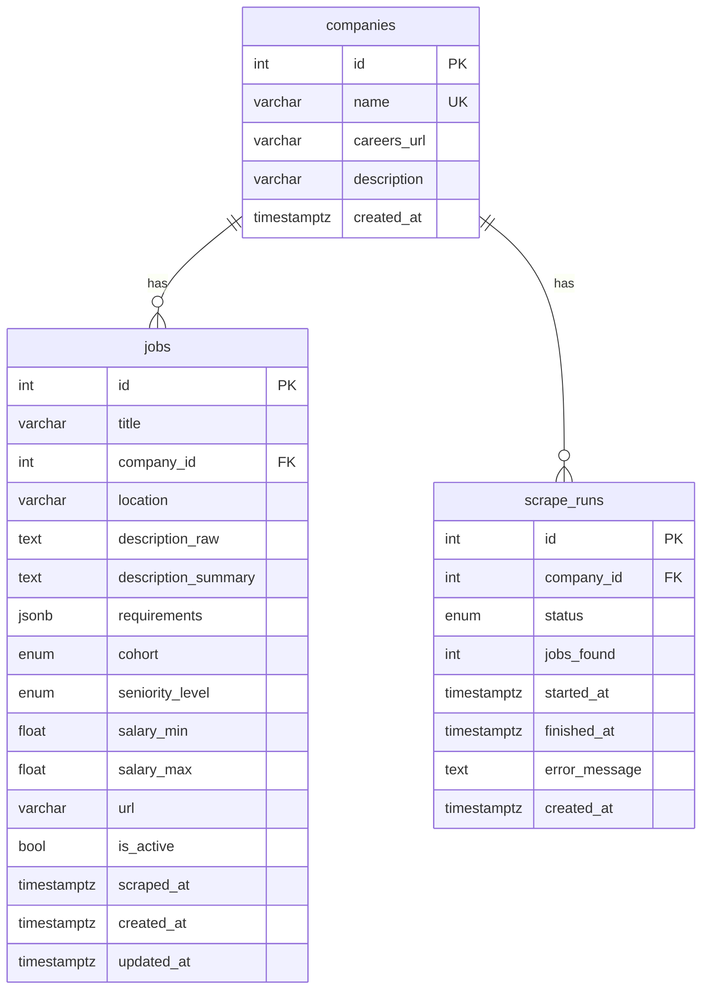

# AutoApply-Agent

GenAI-powered job discovery tool that scrapes corporate career portals, parses job descriptions via Gemini LLM function calling, and serves a searchable, categorized job database.

## Features

- **Autonomous Scraping** — Playwright-based scraper monitors career portals
- **LLM Parsing** — Gemini function calling extracts structured data from messy descriptions
- **Cohort Classification** — Auto-sorts roles into Backend, Testing, Embedded/Hardware, etc.
- **REST API** — Full CRUD with search, filtering, and pagination
- **PostgreSQL** — Robust relational storage with async support

## Quick Start

### 1. Start PostgreSQL

```bash
docker-compose up -d db
```

### 2. Install Dependencies

```bash
python -m venv .venv
source .venv/bin/activate
pip install -e ".[dev]"
```

### 3. Configure Environment

```bash
cp .env.example .env
# Edit .env and set your GEMINI_API_KEY
```

### 4. Run the Server

```bash
uvicorn app.main:app --reload
```

Visit **http://localhost:8000/docs** for interactive API documentation.

### 5. Run Tests

```bash
pytest tests/ -v
```

## API Endpoints

| Method | Endpoint | Description |
|---|---|---|
| `GET` | `/health` | Health check |
| `GET` | `/api/v1/jobs` | List/search jobs |
| `POST` | `/api/v1/jobs` | Create a job |
| `GET` | `/api/v1/jobs/{id}` | Get job details |
| `PUT` | `/api/v1/jobs/{id}` | Update a job |
| `DELETE` | `/api/v1/jobs/{id}` | Soft-delete a job |
| `GET` | `/api/v1/companies` | List companies |
| `POST` | `/api/v1/companies` | Add a company |
| `GET` | `/api/v1/companies/{id}` | Get company details |
| `POST` | `/api/v1/scrape` | Trigger a scrape run |
| `GET` | `/api/v1/scrape/{id}` | Get scrape status |
| `GET` | `/api/v1/scrape` | List scrape runs |

## Database Structure



### `companies`

Stores the companies whose career portals are being monitored.

| Column | Type | Description |
|---|---|---|
| `id` | `SERIAL PK` | Auto-incrementing primary key |
| `name` | `VARCHAR(255) UNIQUE` | Company name (indexed) |
| `careers_url` | `VARCHAR(2048)` | URL of the careers portal |
| `description` | `VARCHAR(1024)` | Optional company description |
| `created_at` | `TIMESTAMPTZ` | Row creation timestamp |

### `jobs`

Parsed and categorized job postings, each linked to a company.

| Column | Type | Description |
|---|---|---|
| `id` | `SERIAL PK` | Auto-incrementing primary key |
| `title` | `VARCHAR(512)` | Job title (indexed) |
| `company_id` | `INT FK` | References `companies.id` (indexed) |
| `location` | `VARCHAR(255)` | Location or "Remote" (indexed) |
| `description_raw` | `TEXT` | Original unstructured description |
| `description_summary` | `TEXT` | LLM-generated summary |
| `requirements` | `JSONB` | Structured requirements (`must_have`, `nice_to_have`, `years_experience`) |
| `cohort` | `ENUM` | Category: Backend, Frontend, Fullstack, Data, ML/AI, DevOps, Testing, Embedded/Hardware, Mobile, Security, Other (indexed) |
| `seniority_level` | `ENUM` | Intern, Junior, Mid, Senior, Staff, Principal, Manager, Director, VP, Other |
| `salary_min` | `FLOAT` | Minimum annual salary (USD) |
| `salary_max` | `FLOAT` | Maximum annual salary (USD) |
| `url` | `VARCHAR(2048)` | Original job posting URL |
| `is_active` | `BOOLEAN` | Soft-delete flag (default: `true`) |
| `scraped_at` | `TIMESTAMPTZ` | When the job was scraped |
| `created_at` | `TIMESTAMPTZ` | Row creation timestamp |
| `updated_at` | `TIMESTAMPTZ` | Last update timestamp |

### `scrape_runs`

Tracks each scraping operation against a company's career portal.

| Column | Type | Description |
|---|---|---|
| `id` | `SERIAL PK` | Auto-incrementing primary key |
| `company_id` | `INT FK` | References `companies.id` (indexed) |
| `status` | `ENUM` | pending, running, completed, failed |
| `jobs_found` | `INT` | Number of jobs discovered |
| `started_at` | `TIMESTAMPTZ` | Scrape start time |
| `finished_at` | `TIMESTAMPTZ` | Scrape end time |
| `error_message` | `TEXT` | Error details if failed |
| `created_at` | `TIMESTAMPTZ` | Row creation timestamp |

## Docker

```bash
# Run everything (app + db)
docker-compose up

# Build only
docker build -t autoapply-agent .
```

## Tech Stack

- **FastAPI** + **Uvicorn** (async Python web framework)
- **SQLAlchemy 2.0** (async ORM)
- **PostgreSQL 16** (database)
- **Alembic** (migrations)
- **Google Gemini** (LLM function calling)
- **Playwright** (web scraping)
- **GitHub Actions** (CI/CD)
